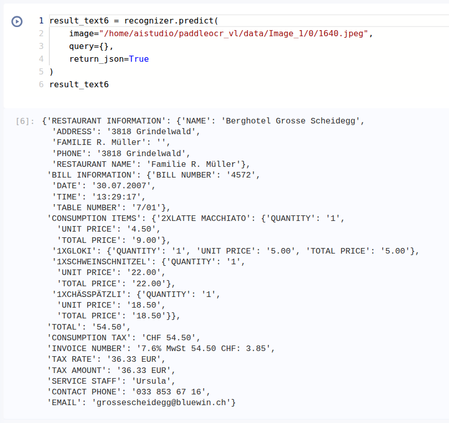

# PaddleOCR-VL Recognition

这是一个 PaddleOCR-VL 识别脚本，只保留了 PaddleOCR 中 VL 识别模型的核心功能。

并且，针对微调的 PaddleOCR-VL 模型 ([megemini/PaddleOCR-VL-Receipt AI Studio](https://aistudio.baidu.com/modelsdetail/41446/intro) 或者 [megemini/PaddleOCR-VL-Receipt Modelscope](https://modelscope.cn/models/megemini/PaddleOCR-VL-Receipt/summary)) 进行了适配，可以使用自定义的 prompt_label 和 query 进行识别。

## 识别效果展示

| 输入图片 | 抽取完整信息 | 抽取特定信息 |
|---------|---------|---------|
|  |  |  |

## 环境安装

### 使用 requirements.txt 安装依赖

```bash
pip install -r requirements.txt
```

### 手动安装（如需要）

```bash
python -m pip install -U "paddleocr[doc-parser]"
python -m pip install https://paddle-whl.bj.bcebos.com/nightly/cu126/safetensors/safetensors-0.6.2.dev0-cp38-abi3-linux_x86_64.whl
python -m pip install --force-reinstall opencv-python-headless
python -m pip install numpy==1.26.4
python -m pip install json-repair
```

## 功能特点

1. ✅ 能够初始化 vl_rec_model
2. ✅ 能够输入一张图片并直接输出识别的文本结果
3. ❌ 不包含文档预处理 (use_doc_preprocessor)
4. ❌ 不包含布局检测 (use_layout_detection)
5. ❌ 不包含图表识别 (use_chart_recognition)
6. ❌ 不包含格式化内容 (format_block_content)
7. ❌ 不包含布局块合并 (merge_layout_blocks)
8. ❌ 不包含 markdown 忽略标签 (markdown_ignore_labels)
9. ❌ 不输出 cls_id, score, coordinate 等额外信息

## 使用方法

### 方法 1: 命令行使用

```bash
python paddleocr_vl_rec.py --image /path/to/your/image.jpg --model_dir /path/to/model
```

可选参数:

- `--model_name`: 模型名称 (默认: PaddleOCR-VL-0.9B)
- `--model_dir`: 模型目录路径 (可选)
- `--device`: 设备 (例如: 'cpu', 'gpu:0')
- `--prompt_label`: 识别任务类型 (默认: 'ocr')
  - 可选值: 'ocr', 'table', 'formula', 'chart'
- `--query`: 额外的自定义提示词 (可选，如提供则追加到 prompt_label 后面)
  - 命令行中支持字符串格式
- `--max_new_tokens`: 最大生成 token 数 (默认: 4096)
- `--return_json`: 将结果解析为 JSON 格式返回 (默认: False)

### 方法 2: 作为 Python 模块使用

```python
from paddleocr_vl_rec import PaddleOCRVLRec

# 初始化识别器
recognizer = PaddleOCRVLRec(
    model_name="PaddleOCR-VL-0.9B", # 可选，默认为 "PaddleOCR-VL-0.9B"
    model_dir="path/to/your/model",
    device="gpu:0"  # 或 "cpu"
)

# 识别图片中的文本（使用 prompt_label）
result_text = recognizer.predict(
    image="/path/to/your/image.jpg",
    prompt_label="ocr" # 可选，默认为 "ocr"
)

print(result_text)

# 关闭模型
recognizer.close()
```

### 方法 3: 使用 dict 或 list 作为 query

> **注意**: 此方法只能使用微调后的模型，默认模型无法正确识别并输出 JSON 格式的结果。

```python
from paddleocr_vl_rec import PaddleOCRVLRec

# 初始化识别器
recognizer = PaddleOCRVLRec(
    model_dir="path/to/your/model"
)

# 使用 dict 作为 query（会被转化为 JSON 字符串）
# 返回 JSON 格式（使用 json_repair 解析结果）
result_json = recognizer.predict(
    image="/path/to/your/image.jpg",
    query={"NAME":"", "ITEMS":[]},
    return_json=True
)
# result_json 是一个字典对象
print(type(result_json))  # <class 'dict'>
print(result_json)

# 使用 list 作为 query（会被转化为 {"item1":"", "item2":""} 的形式）
result_json = recognizer.predict(
    image="/path/to/your/image.jpg",
    query=["item1", "item2"],
    return_json=True
)
print(result_json)

recognizer.close()
```

## 其他示例

### OCR 文本识别

```bash
python paddleocr_vl_rec.py --image document.jpg --prompt_label ocr
```

### 表格识别

```bash
python paddleocr_vl_rec.py --image table.jpg --prompt_label table
```

### 公式识别

```bash
python paddleocr_vl_rec.py --image formula.jpg --prompt_label formula
```

### 图表识别

```bash
python paddleocr_vl_rec.py --image chart.jpg --prompt_label chart
```

### 组合使用 prompt_label 和 query

```bash
# query 将被追加到 prompt_label 的提示词后面
# 最终提示词: "OCR:" + "{\"ITEM\":\"\", \"AMOUNT\":\"\"}"
python paddleocr_vl_rec.py --image document.jpg --prompt_label ocr --query "{\"ITEM\":\"\", \"AMOUNT\":\"\"}"
```
