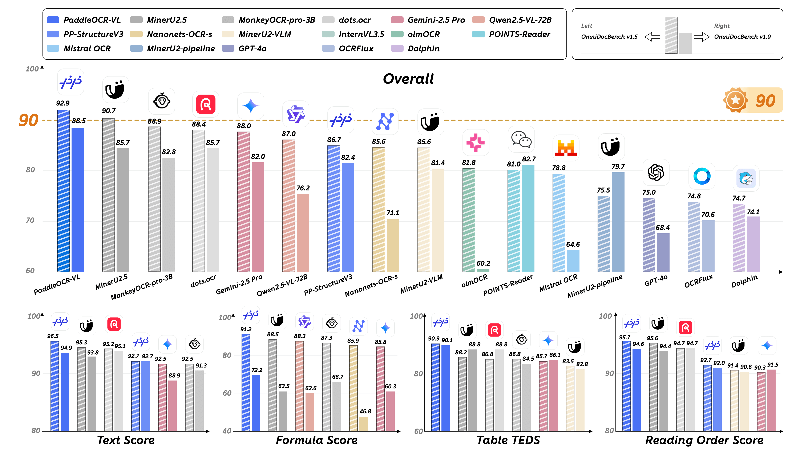
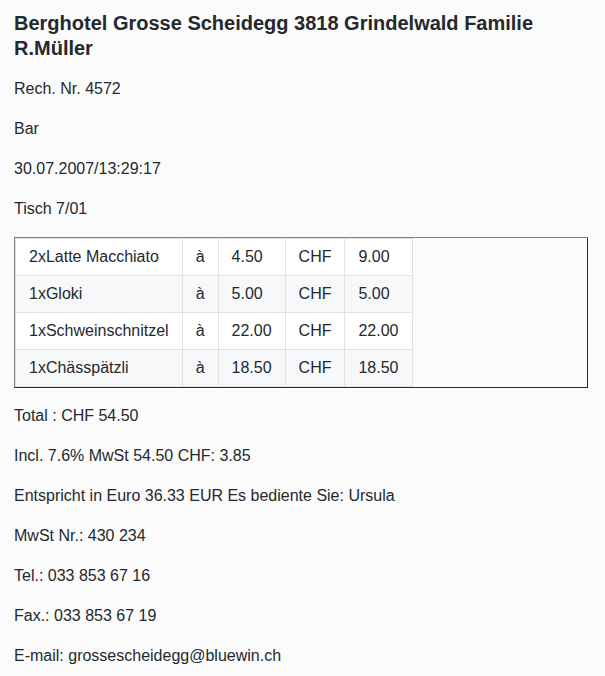
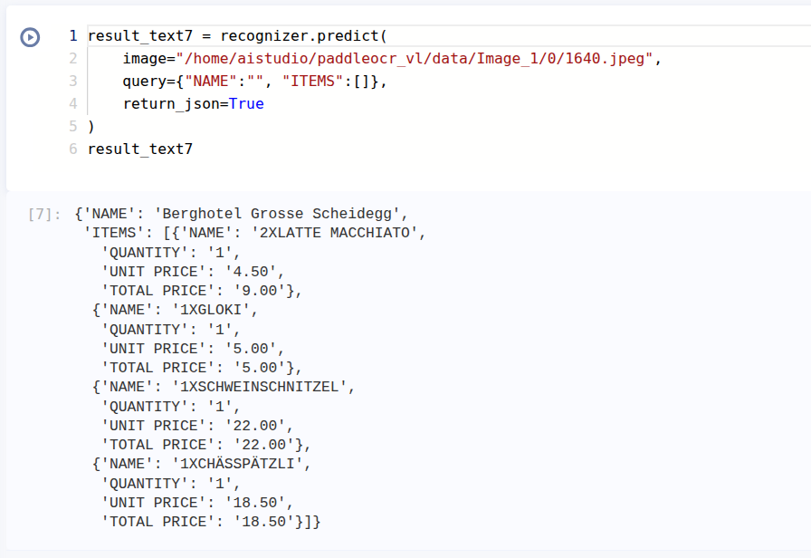
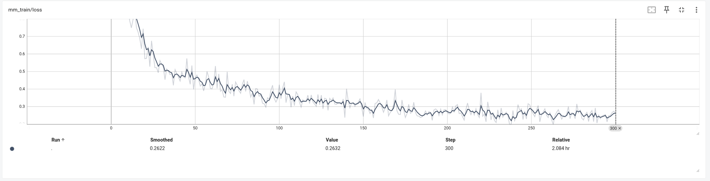

# 微调 PaddleOCR-VL 新姿势 -- Prompt 与 信息抽取

> AI Studio 项目地址：[微调 PaddleOCR-VL 新姿势 -- Prompt 与 信息抽取](https://aistudio.baidu.com/projectdetail/9857242) ，可在 AI Studio 的 A100 环境中直接运行（V100 环境只能进行模型推理，无法进行微调）

## 引言

PaddleOCR-VL 是一款专为文档解析设计的视觉-语言模型（Vision-Language Model, VLM），在页面级文档解析和元素级识别方面都达到了SOTA性能。



当使用 PaddleOCR-VL 时，可以通过提示词（Prompt）完成多种文档类型的理解任务，包括文本识别（OCR）、表格识别、公式识别和图表识别:

```python
CHOSEN_TASK = "ocr"  # Options: 'ocr' | 'table' | 'chart' | 'formula'
PROMPTS = {
    "ocr": "OCR:",
    "table": "Table Recognition:",
    "formula": "Formula Recognition:",
    "chart": "Chart Recognition:",
}
```

目前对于 PaddleOCR-VL 的微调 [PaddleOCR-VL-0.9B SFT](https://github.com/PaddlePaddle/ERNIE/blob/release/v1.4/docs/paddleocr_vl_sft_zh.md) 也是围绕这四类任务展开的，比如 [Fine-tuning PaddleOCR-VL for Manga](https://pfcc.blog/posts/paddleocr-vl-for-manga) 中介绍了如何微调模型使其在漫画文字的识别方面提高识别率。

本文介绍一种新的微调方式，从微调 PaddleOCR-VL 的 `prompt` 入手，介绍如何通过微调 PaddleOCR-VL 用于 `信息抽取`。

这里以一张收据为例：

| 输入图片 | 微调前 (OCR 识别) | 微调后 (抽取特定信息) |
|---------|---------|---------|
|  |  |  |

微调之后可以输出 `JSON` 格式的数据，并且可以根据不同的 `prompt` 抽取对应的信息。

> 这里录制了一段简单的在 AI Studio 中 SFT 与推理过程的视频 [PaddleOCR-VL SFT with Prompt](https://www.bilibili.com/video/BV1cTq5BvEb2/?vd_source=52a02e4f0aa6b27776bd86a6d103f2d1)


关于 PaddleOCR-VL 的微调，[PaddleOCR-VL-0.9B SFT](https://github.com/PaddlePaddle/ERNIE/blob/release/v1.4/docs/paddleocr_vl_sft_zh.md) 中已经有很详细的讲解。针对 `prompt` 进行微调，以下部分略有不同：

- 数据准备
- 模型推理

## 数据准备

本文使用的数据集为 [Spatial Dual-Modality Graph Reasoning for Key Information Extraction](https://arxiv.org/abs/2103.14470v1) 中介绍的数据集 [Wildreceipt dataset](https://download.openmmlab.com/mmocr/data/wildreceipt.tar) 。数据集中收集了 1768 张收据图片，比如：


由于后续使用 [ERNIE](https://github.com/PaddlePaddle/ERNIE) 对 PaddleOCR-VL 进行微调，需要准备 `JSON` 格式的数据与对应的图片数据，以下是所需的数据格式：

```json
{
    "image_info": [{
        "matched_text_index": 0,
        "image_url": "./assets/table_example.jps"
    }, ],
    "text_info": [{
            "text": "OCR:",
            "tag": "mask"
        },
        {
            "text": "দডর মথ বধ বকসট একনজর দখই চনত পরল তর অনমন\nঠক পনতই লকয রখছ\nর নচ থকই চচয বলল কশর, “এইই; পযছ! পযছ!'\nওপর",
            "tag": "no_mask"
        },
    ]
}
```

其中，

- `image_url` 是图片的路径
- `tag` 是 `mask` 的 `text_info` 对应 `prompt` 部分，也就是 PaddleOCR-VL 的 `TASK` 类型
- `tag` 是 `no_mask` 的 `text_info` 对应 `completion` 部分，也就是模型的输出

原始模型中只有

```json
{
    "ocr": "OCR:",
    "table": "Table Recognition:",
    "formula": "Formula Recognition:",
    "chart": "Chart Recognition:",
}
```

这四类 `prompt`，而我们希望，模型能够根据我们的指令抽取对应的信息，因此需要自定义 `prompt`：

```json
{
    "image_info": [{
        "matched_text_index": 0,
        "image_url": "path/to/image.jpg"
    }],
    "text_info": [{
            "text": "OCR:{\"RECEIPT NUMBER\": \"\"}",
            "tag": "mask"
        },
        {
            "text": "{\"RECEIPT NUMBER\": \"123456789\"}",
            "tag": "no_mask"
        }
    ]
}
```

这里 `tag` 为 `mask` 的 `text` 不是 `OCR:` 而是 `OCR:{"RECEIPT NUMBER": ""}`，也就是说，我们希望模型抽取，且仅抽取 `RECEIPT NUMBER` 字段的信息，并输出对应的 `JSON` 格式的结果。保留原始的 `OCR:` 部分，是为了保证模型能够识别 `OCR:` 部分，而仅对 `{"RECEIPT NUMBER": ""}` 部分进行微调。

`tag` 为 `no_mask` 的 `text` 部分直接输出 `JSON` 格式的数据，并且与 `prompt` 对应。

针对不同的信息格式，我们这里设计 `prompt` 为：

```text
# 抽取全量信息
OCR:{}

# 抽取特定值为字符串，如 `{"NUMBER":"123456"}`
OCR:{"FIELD":""}

# 抽取特定值为字典，如 `{"ITEM":{"NAME":"foo"}}`
OCR:{"FIELD":{}}

# 抽取特定值为列表，如 `{"ITMES":[{"NAME":"foo"},{"NAME":"bar"}]}`
OCR:{"FIELD":[]}
```

我们这里使用 VLM 模型 (ERNIE 4.5 VL) 对每张图片生成完整的 `JSON` 格式的数据，然后随机抽取部分字段组成训练数据，具体如何构建数据集，可以参考后续的附录部分。

## 模型微调

微调的过程与 [PaddleOCR-VL-0.9B SFT](https://github.com/PaddlePaddle/ERNIE/blob/release/v1.4/docs/paddleocr_vl_sft_zh.md) 类似，首先安装 ERNIE：

```bash
cd paddleocr_vl
git clone https://github.com/PaddlePaddle/ERNIE -b release/v1.4
cd ERNIE
python -m pip install -r requirements/gpu/requirements.txt
python -m pip install -e .
python -m pip install tensorboard
python -m pip install opencv-python-headless
python -m pip install numpy==1.26.4
```

然后，修改配置文件并复制覆盖原有配置文件：

```bash
cp paddleocr_vl/sft_config/run_ocr_vl_sft_16k.yaml \
  paddleocr_vl/ERNIE/examples/configs/PaddleOCR-VL/sft/run_ocr_vl_sft_16k.yaml
```

下载 PaddleOCR-VL 模型，这里使用 modelscope 的 SDK：

```bash
pip install modelscope
```

```python
from modelscope import snapshot_download
model_dir = snapshot_download('PaddlePaddle/PaddleOCR-VL', local_dir='paddleocr_vl/paddleocr_vl_model')
```

最后，就是执行微调命令即可，在 AI Studio 的 A800 环境中进行微调，大约需要不到 3 小时。

> V100 环境无法执行微调，但是可以进行模型推理

```bash
cd paddleocr_vl/ERNIE; CUDA_VISIBLE_DEVICES=0 \
 erniekit train examples/configs/PaddleOCR-VL/sft/run_ocr_vl_sft_16k.yaml
```

以下是训练的日志：



可以看到，`loss` 在稳定的下降，说明微调应该有效果。

## 模型推理

微调完成后，可以使用微调后的模型进行推理，并：

1. 输出 `JSON` 格式的完整信息
2. 根据不同的输入字段，输出对应的 `JSON` 格式的信息

这为信息抽取任务提供了灵活的接口。

这里介绍三种模型推理的方式：

- [PaddleOCR](https://github.com/PaddlePaddle/PaddleOCR)
- [transformers](https://github.com/huggingface/transformers)
- [PaddleOCR-VL-REC](https://github.com/megemini/PaddleOCR-VL-REC)

### 使用 PaddleOCR 进行推理

按照 [PaddleOCR-VL-0.9B SFT](https://github.com/PaddlePaddle/ERNIE/blob/release/v1.4/docs/paddleocr_vl_sft_zh.md) 进行推理，首先需要安装必要的环境

```bash
python -m pip install -U "paddleocr[doc-parser]"
python -m pip install https://paddle-whl.bj.bcebos.com/nightly/cu126/safetensors/safetensors-0.6.2.dev0-cp38-abi3-linux_x86_64.whl
python -m pip install --force-reinstall opencv-python-headless
python -m pip install numpy==1.26.4
```

此时，还不能直接进行模型的推理，因为，PaddleOCR 依赖的 PaddleX 中，目前对于 PaddleOCR-VL 仅支持 `['ocr', 'formula', 'table', 'chart']` 这四类 `prompt_label`，而我们的 `prompt` 显然无法通过代码的验证：

参考 `paddlex/inference/pipelines/paddleocr_vl/pipeline.py` 文件

``` python
assert prompt_label.lower() in [
    "ocr",
    "formula",
    "table",
    "chart",
], f"Layout detection is disabled (use_layout_detection=False). 'prompt_label' must be one of ['ocr', 'formula', 'table', 'chart'], but got '{prompt_label}'."

```

这里写了一个 [patch 脚本](https://github.com/megemini/PaddleOCR-VL-REC/blob/master/docs/paddleocr_vl/patch/patch_assert_to_warning.py)，可以绕过以上限制：

```bash
python paddleocr_vl/patch/patch_assert_to_warning.py
```

然后，将以下文件拷贝到 PaddleOCR-VL-SFT 目录下，就可以愉快的进行推理验证了。

```bash
cp paddleocr_vl/paddleocr_vl_model/chat_template.jinja paddleocr_vl/PaddleOCR-VL-SFT
cp paddleocr_vl/paddleocr_vl_model/inference.yml paddleocr_vl/PaddleOCR-VL-SFT
```

这里以上文中的那张收据来进行模型的验证。

```bash
python -m paddleocr doc_parser -i /home/aistudio/paddleocr_vl/data/Image_1/0/1640.jpeg \
    --vl_rec_model_name "PaddleOCR-VL-0.9B" \
    --vl_rec_model_dir "paddleocr_vl/PaddleOCR-VL-SFT" \
    --save_path="paddleocr_vl/PaddleOCR-VL-SFT_response" \
    --use_layout_detection=False \
    --prompt_label="OCR:{}"
```

输出完整的信息：

```json
{
    "RESTAURANT INFORMATION": {
        "NAME": "Berghotel Grosse Scheidegg",
        "ADDRESS": "3818 Grindelwald Familie R. Müller",
        "PHONE": ""
    },
    "BILL INFORMATION": {
        "BILL NUMBER": "4572",
        "DATE": "30.07.2007",
        "TIME": "13:29:17",
        "TABLE NUMBER": "7/01"
    },
    "CONSUMPTION ITEMS": {
        "2XLATTE MACCHIATO": {
            "QUANTITY": "1",
            "UNIT PRICE": "4.50",
            "TOTAL PRICE": "9.00"
        },
        "1XGLOKI": {
            "QUANTITY": "1",
            "UNIT PRICE": "5.00",
            "TOTAL PRICE": "5.00"
        },
        "1XSCHWEINSCHNITZEL": {
            "QUANTITY": "1",
            "UNIT PRICE": "22.00",
            "TOTAL PRICE": "22.00"
        },
        "1XCHÄSSPÄTZLI": {
            "QUANTITY": "1",
            "UNIT PRICE": "18.50",
            "TOTAL PRICE": "18.50"
        }
    },
    "TOTAL": "54.50",
    "CONSUMPTION TAX": "7.6% MwSt 54.50 CHF: 3.85",
    "TAX RATE": "7.6% EUR",
    "TAX AMOUNT": "36.33 EUR",
    "SERVICE STAFF": "Ursula",
    "CONTACT PHONE": "033 853 67 16",
    "EMAIL": "grossescheidegg@bluewin.ch"
}
```

注意两点：

- `use_layout_detection=False`，不通过 layout 模型，而是直接将图片送入 `PaddleOCR-VL-0.9B`
- `prompt_label="OCR:{}"`，这里使用我们微调的 `prompt` ，希望模型输出完整的 json 格式的信息

然后，测试一下只抽取部分信息：

```bash
python -m paddleocr doc_parser -i /home/aistudio/paddleocr_vl/data/Image_1/0/1640.jpeg \
    --vl_rec_model_name "PaddleOCR-VL-0.9B" \
    --vl_rec_model_dir "paddleocr_vl/PaddleOCR-VL-SFT" \
    --save_path="paddleocr_vl/PaddleOCR-VL-SFT_response" \
    --use_layout_detection=False \
    --prompt_label="OCR:{\"NAME\":\"\", \"ITEMS\":[]}"
```

输出：

```json
{
    "NAME": "Berghotel Grosse Scheidegg",
    "ITEMS": [{
        "NAME": "2XLATTE MACCHIATO",
        "QUANTITY": "1",
        "UNIT PRICE": "4.50",
        "TOTAL PRICE": "9.00"
    }, {
        "NAME": "1XGLOKI",
        "QUANTITY": "1",
        "UNIT PRICE": "5.00",
        "TOTAL PRICE": "5.00"
    }, {
        "NAME": "1XSCHWEINSCHNITZEL",
        "QUANTITY": "1",
        "UNIT PRICE": "22.00",
        "TOTAL PRICE": "22.00"
    }, {
        "NAME": "1XCHÄSSPÄTZLI",
        "QUANTITY": "1",
        "UNIT PRICE": "18.50",
        "TOTAL PRICE": "18.50"
    }],
    "TOTAL": "54.50",
    "CHF": "3.85",
    "INCL.": "7.6% MwSt",
    "CHF": "54.50",
    "EUR": "36.33",
    "ES BEDIENTE SIE": "Ursula",
    "MWST NR.": "430 234",
    "TEL.": "033 853 67 16",
    "FAX.": "033 853 67 19",
    "E-MAIL": "grossescheidegg@bluewin.ch"
}]
```

可以看到，模型基本上可以跟随我们的指令抽取对应的信息。

但是，仍然有一些瑕疵，比如：

- 模型不仅抽取了 `NAME` 和 `ITEMS` 信息，还抽取了其他的几个字段信息，说明微调后的模型还是存在一些指令跟随的瑕疵，可以通过扩展数据集的数量加强训练来解决。
- 模型输出的 `JSON` 格式不完整，这也是大模型的一个通病，有一些工具可以缓解此类问题，比如 [json_repair](https://github.com/mangiucugna/json_repair/)

### 使用 transformers 进行推理

可以使用 transformers 库进行信息抽取，参考 [[Model] Add PaddleOCR-VL Model Support by zhang-prog](https://github.com/huggingface/transformers/pull/42178)

> 注意，目前微调后生成的模型目录还没有同步更新，在使用 transformers 库进行信息抽取时，需要先下载 [huggingface](https://huggingface.co/PaddlePaddle/PaddleOCR-VL/tree/main) 中最新的模型，然后，将微调后的模型文件 `model-00001-of-00001.safetensors` 重命名为 `model.safetensors`，并放到（并覆盖）下载的模型目录下。

```python
from transformers import pipeline

pipe = pipeline(
    "image-text-to-text", 
    model="./PaddleOCR_VL_SFT/PaddleOCR-VL", # 下载的模型目录
    dtype="bfloat16")
messages = [
    {
        "role": "user",
        "content": [
            {"type": "image", "url": "path/to/image.jpg"},
            {"type": "text", "text": "OCR:{}"},
        ]
    }
]
result = pipe(text=messages)
print(result)

```

如果显存不足，可以尝试以下量化方法：

```python
from transformers import AutoProcessor, AutoModelForImageTextToText, BitsAndBytesConfig
import torch

path = "./PaddleOCR_VL_SFT/PaddleOCR-VL", # 下载的模型目录
processor = AutoProcessor.from_pretrained(path, local_files_only=True, use_fast=True)

# 4-bit 量化配置，大幅减少显存占用
quantization_config = BitsAndBytesConfig(
    load_in_4bit=True,
    bnb_4bit_compute_dtype=torch.bfloat16,
    bnb_4bit_use_double_quant=True,
    bnb_4bit_quant_type="nf4"
)
model = AutoModelForImageTextToText.from_pretrained(
    path,
    quantization_config=quantization_config,
    # device_map="auto",
    local_files_only=True
)
messages = [
    {
        "role": "user",
        "content": [
            {"type": "image", "url": "path/to/image.jpg"},
            {"type": "text", "text": "OCR:{\"NAME\": \"\"}"},
        ]
    }
]
inputs = processor.apply_chat_template(
    messages,
    add_generation_prompt=True,
    tokenize=True,
    return_dict=True,
    return_tensors="pt",
).to(model.device)

outputs = model.generate(**inputs, max_new_tokens=100)
result = processor.decode(outputs[0][inputs["input_ids"].shape[-1]:-1])
print(result)

```

### 使用 PaddleOCR-VL-REC 进行信息抽取

可以使用 [PaddleOCR-VL-REC](https://github.com/megemini/PaddleOCR-VL-REC) 进行信息抽取：

```python
from paddleocr_vl_rec import PaddleOCRVLRec

# 初始化识别器
recognizer = PaddleOCRVLRec(
    model_dir="path/to/your/model"
)

# 使用 dict 作为 query（会被转化为 JSON 字符串）
# 返回 JSON 格式（使用 json_repair 解析结果）
result_json = recognizer.predict(
    image="/path/to/your/image.jpg",
    query={"NAME":"", "ITEMS":[]},
    return_json=True
)
# result_json 是一个字典对象
print(type(result_json))  # <class 'dict'>
print(result_json)

# 使用 list 作为 query（会被转化为 {"ITEM1":"", "ITEM2":""} 的形式）
result_json = recognizer.predict(
    image="/path/to/your/image.jpg",
    query=["ITEM1", "ITEM2"],
    return_json=True
)
print(result_json)

recognizer.close()

```

工具简化了 PaddleOCR 中对于 PaddleOCR-VL 模型的调用过程，跳过了 PP-DocLayoutV2 模型的预处理，直接使用 PaddleOCR-VL-0.9B 模型进行推理，并且，使用 [json_repair](https://github.com/mangiucugna/json_repair/) 对结果进行了修复，使用起来更简单。

比如，使用 [PaddleOCR-VL-REC](https://github.com/megemini/PaddleOCR-VL-REC) 对上面的收据抽取部分信息，得到格式完整的 `JSON` 结果：


## 总结

本文介绍了如何通过微调 PaddleOCR-VL 的提示词（prompt）来实现信息抽取任务。主要方法包括：

1. **提示词设计**：通过设计提示词模板，让模型能够灵活地输出不同字段的 `JSON` 格式信息。
2. **模型微调**：利用 PaddleOCR-VL 的微调能力，使其学会根据不同的提示词生成对应的输出。

这种方法相比于传统的信息抽取方法（如 NER + 关系抽取），具有更好的集成度和灵活性。

## 附录

### 1. 数据集

信息抽取的应用场景有很多，这里以 [增值税普通发票](https://aistudio.baidu.com/datasetdetail/125158) 数据为例。

> 可以参考 [基于VI-LayoutXLM的发票关键信息抽取](https://bbs.huaweicloud.com/blogs/383854) 这篇文章，对于微调 PaddleOCR 模型进行信息抽取做了比较完整的讲解。

但是，数据集对于 `关系抽取（Relation Extraction）` 的标注还是比较简陋的，比如:


这里只标注了 `名称`，而没有标注说明是 `购买方名称` 还是 `销售方名称`。

前面提到，我们可以把 PaddleOCR-VL 当作 VLM 模型来使用，那么，我们可以让能力更强的 VLM 模型来 `教` PaddleOCR-VL 去识别 `购买方名称` 和 `销售方名称`。

数据可以通过 `ernie-4.5-turbo-vl-preview` 模型来生成，参考脚本 [extract_ner.py](https://github.com/megemini/PaddleOCR-VL-REC/blob/master/docs/paddleocr_vl/tools/extract_ner/extract_ner.py)。

``` python

#!/usr/bin/env python3
# -*- coding: utf-8 -*-
"""
多模态图像识别脚本
通过调用OpenAI接口识别图片信息并返回JSON格式数据
支持本地图片和多模态大模型处理
"""
...

class MultimodalImageRecognizer:
    """多模态图像识别器"""
    ...

    def recognize_image(
        self,
        image_input: Union[str, bytes],
        prompt: str,
        system_prompt: str,
        max_tokens: int = 2048
    ) -> Dict[str, Any]:
        """
        识别图片信息

        Args:
            image_input: 图片路径、URL或base64编码
            prompt: 用户提示词
            system_prompt: 系统提示词
            max_tokens: 最大令牌数

        Returns:
            识别结果的JSON格式数据
        """
        try:
            # 创建多模态消息
            content = self.create_multimodal_message(prompt, image_input)

            # 构建消息列表
            messages = [
                {"role": "system", "content": system_prompt},
                {"role": "user", "content": content}
            ]

            logger.info(f"开始调用API识别图片，模型: {self.model}")

            # 调用API
            response = self.client.chat.completions.create(
                model=self.model,
                messages=messages,
                max_tokens=max_tokens,
                temperature=0.2
            )

    ...

    def analyze_image(
        self,
        image_input: Union[str, bytes],
        analysis_type: str = "document"
    ) -> Dict[str, Any]:
        """
        分析图片内容（简化版本）

        Args:
            image_input: 图片路径、URL或base64编码
            analysis_type: 分析类型，固定为 "document"

        Returns:
            分析结果的JSON格式数据
        """
        # 统一使用文档分析提示词
        prompt = "请分析这张文档图片中的所有信息，并返回完整的JSON格式数据。如果有的字段没有值，那么保留此字段，值为空。注意：所有的值都以string的形式返回，不要使用数字类型等。"
        system_prompt = '''
你是一个专业的文档分析助手，能够准确分析文档内容并返回结构化的JSON数据。

注意：数据的语言与文档的语言保持一致。
注意：需要保留完整的字段层级关系，不要把所有字段都放到一级字段中。
注意：JSON数据中不要包含注释，也不需要任何解释或说明。
注意：对于特殊字符需要进行转义。

注意：对于选项字段，只保留所选择的字段值，如果没有选择，则置为空。
比如，`业务类型` 包括 `账户开户、账户登记` 等选项，文档中`账户登记`是选中状态，则，返回 `{"业务类型"："账户登记"}`，不返回`账户开户`等其他选项。
再比如，`业务类型` 包括 `账户开户、账户登记` 等选项，文档中没有标记选中的选项，则，返回 `{"业务类型"：""}`，也就是说，只保留键，不需要有值。
...
'''

        return self.recognize_image(
            image_input=image_input,
            prompt=prompt,
            system_prompt=system_prompt
        )

...
```

使用 [batch_extract_ner.py](https://github.com/megemini/PaddleOCR-VL-REC/blob/master/docs/paddleocr_vl/tools/extract_ner/batch_extract_ner.py) 脚本可以批量生成数据，最终生成的数据参考如下：

``` json

{
  "image": "/media/shun/bigdata/Dataset/增值税普通发票/zzsptfp/b0.jpg",
  "data": {
    "发票名称": "广东增值税专用发票",
    "发票编号": "12271524",
    "发票代码": "4400154130",
    "开票日期": "2016年06月12日",
    "购买方": {
      "名称": "深圳市购机汇网络有限公司",
      "纳税人识别号": "440300083885931",
      "地址、电话": "深圳市龙华新区民治街道民治大道展滔科技大厦A12070755-23806606",
      "开户行及账号": "中国工商银行股份有限公司深圳园岭支行4000024709200172809"
    },
    "密码区": "<<1<//3*26-++936-9<9*575>39 -<5//81>84974<00+7>2*0*53-+ +125*++9+-///5-7+/-0>8<9815 5<3/8*+//81/84+>6>4*36>4538",
    "货物或应税劳务、服务名称": [
      {
        "名称": "小米 红米3 全网通版 时尚金色",
        "规格型号": "红米3",
        "单位": "个",
        "数量": "5",
        "单价": "597.43589744",
        "金额": "2987.18",
        "税率": "17%",
        "税额": "507.82"
      },
      {
        "名称": "移动联通电信4G手机 双卡双待",
        "规格型号": "",
        "单位": "",
        "数量": "",
        "单价": "",
        "金额": "",
        "税率": "",
        "税额": ""
      }
    ],
    "合计": {
      "金额": "￥2987.18",
      "税额": "￥507.82"
    },
    "价税合计（大写）": "叁仟肆佰玖拾伍圆整",
    "价税合计（小写）": "￥3495.00",
    "销售方": {
      "名称": "广州晶东贸易有限公司",
      "纳税人识别号": "91440101664041243T",
      "地址、电话": "广州市黄埔区九龙镇九龙工业园凤凰三横路99号 66215500",
      "开户行及账号": "工行北京路支行3602000919200384952"
    },
    "备注": "dd42982413947(00001,1952)7996有限",
    "收款人": "王梅",
    "复核": "张雪",
    "开票人": "陈秋燕",
    "销售方（章）": "广州晶东贸易有限公司 发票专用章"
  }
}

```

这里生成的数据信息比原有的标注信息丰富很多，虽然有一些瑕疵 (比如 `货物或应税劳务、服务名称` 中应该只有一条记录)，但是不妨碍进行微调实验的进行。

> 处理后的数据已经上传至 [增值税普通发票与JSON格式信息](https://aistudio.baidu.com/dataset/detail/363136/intro)。

### 2. 提示词

可以使用 [process_ner_dataset.py](https://github.com/megemini/PaddleOCR-VL-REC/blob/master/docs/paddleocr_vl/tools/process_ner_dataset.py) 生成完整的训练数据，包括随机生成的提示词：

```bash
python paddleocr_vl/tools/process_ner_dataset.py paddleocr_vl/data/zzsptfp \
  -o paddleocr_vl/output.jsonl \
  -n 10 \
  -p /media/shun/bigdata/Dataset/增值税普通发票 \
  -u /home/aistudio/paddleocr_vl/data/zzsptfp
```

之后，[split_jsonl.py](https://github.com/megemini/PaddleOCR-VL-REC/blob/master/docs/paddleocr_vl/tools/split_jsonl.py) 拆分训练数据集与验证数据集：

```bash
python paddleocr_vl/tools/split_jsonl.py paddleocr_vl/output.jsonl \
  paddleocr_vl/output \
  --train_ratio 0.9 \
  --seed 123
```

最终生成的数据参考如下：

```json
{
    "image_info": [
        {
            "matched_text_index": 0,
            "image_url": "/home/aistudio/paddleocr_vl/data/zzsptfp/zzsptfp/b175.jpg"
        }
    ],
    "text_info": [
        {
            "text": "OCR:{\"发票名称\": \"\"}",
            "tag": "mask"
        },
        {
            "text": "{\"发票名称\": \"广东增值税专用发票\"}",
            "tag": "no_mask"
        }
    ]
}
```

生成的训练数据与 [PaddleOCR-VL-0.9B SFT](https://github.com/PaddlePaddle/ERNIE/blob/release/v1.4/docs/paddleocr_vl_sft_zh.md) 不同处有：

- `mask` 的 `text` 不仅仅是 `OCR:` ，还包括之后需要抽取的字段信息
- `no_mask` 的 `text` 是完整的 `JSON` 格式信息，而不是一段纯文本

### 3. 配置文件示例

```yaml
### data
train_dataset_type: "erniekit"
eval_dataset_type: "erniekit"
train_dataset_path: "/home/aistudio/paddleocr_vl/output_train.jsonl"
train_dataset_prob: "1.0"
eval_dataset_path: "/home/aistudio/paddleocr_vl/output_val.jsonl"
eval_dataset_prob: "1.0"
max_seq_len: 16384
num_samples_each_epoch: 6000000
use_pic_id: False
sft_replace_ids: True
sft_image_normalize: True
sft_image_rescale: True
image_dtype: "float32"

### model
model_name_or_path: "/home/aistudio/paddleocr_vl/paddleocr_vl_model"
fine_tuning: Full
multimodal: True
use_flash_attention: True
use_sparse_flash_attn: True

### finetuning
# base
stage: OCR-VL-SFT
seed: 23
do_train: True
# do_eval: True
distributed_dataloader: False
dataloader_num_workers: 8
prefetch_factor: 10
batch_size: 1
packing_size: 8
packing: True
padding: False
num_train_epochs: 2
max_steps: 80
# eval_batch_size: 1
# eval_iters: 50
# eval_steps: 100
# evaluation_strategy: steps
save_steps: 20
save_total_limit: 5
save_strategy: steps
logging_steps: 1
release_grads: True
gradient_accumulation_steps: 8
logging_dir: /home/aistudio/paddleocr_vl/PaddleOCR-VL-SFT/tensorboard_logs/
output_dir: /home/aistudio/paddleocr_vl/PaddleOCR-VL-SFT
disable_tqdm: True

# train
warmup_steps: 1
learning_rate: 5.0e-6
lr_scheduler_type: cosine
min_lr: 5.0e-7
layerwise_lr_decay_bound: 1.0
from_scratch: 0

# optimizer
weight_decay: 0.1
adam_epsilon: 1.0e-8
adam_beta1: 0.9
adam_beta2: 0.95

# performance
tensor_parallel_degree: 1
pipeline_parallel_degree: 1
sharding_parallel_degree: 1
sharding: stage1
sequence_parallel: False
pipeline_parallel_config: enable_delay_scale_loss enable_release_grads disable_partial_send_recv
recompute: True
recompute_granularity: "full"
recompute_use_reentrant: True
compute_type: bf16
fp16_opt_level: O2
disable_ckpt_quant: True
# amp_master_grad: True
amp_custom_white_list:
  - lookup_table
  - lookup_table_v2
  - flash_attn
  - matmul
  - matmul_v2
  - fused_gemm_epilogue
amp_custom_black_list:
  - reduce_sum
  - softmax_with_cross_entropy
  - c_softmax_with_cross_entropy
  - elementwise_div
  - sin
  - cos
unified_checkpoint: True
# unified_checkpoint_config: async_save
convert_from_hf: True
save_to_hf: True
```

### 4. 资源链接

- AI Studio 项目地址：[微调 PaddleOCR-VL 新姿势 -- Prompt 与 信息抽取](https://aistudio.baidu.com/projectdetail/9857242) ，可在 AI Studio 的 A100 环境中直接运行（V100 环境只能进行模型推理，无法进行微调）
- 模型地址：[megemini/PaddleOCR-VL-Receipt](https://modelscope.cn/models/megemini/PaddleOCR-VL-Receipt/summary)
- 推理工具：[PaddleOCR-VL-REC](https://github.com/megemini/PaddleOCR-VL-REC)
- 数据集：[Wildreceipt arxiv](https://arxiv.org/abs/2103.14470v1), [Wildreceipt dataset](https://download.openmmlab.com/mmocr/data/wildreceipt.tar)
- SFT 过程视频：[PaddleOCR-VL SFT with Prompt](https://www.bilibili.com/video/BV1cTq5BvEb2/?vd_source=52a02e4f0aa6b27776bd86a6d103f2d1)
